<center>

# UT2-A1: Implantación de arquitecturas web


</center>

***Nombre: Adrián Hernández Dévora***
***Curso:*** 2º de Ciclo Superior de Desarrollo de Aplicaciones Web.

### ÍNDICE

+ [Introducción](#id1)
+ [Objetivos](#id2)
+ [Material empleado](#id3)
+ [Desarrollo](#id4)
+ [Conclusiones](#id5)


#### ***Introducción***. <a name="id1"></a>

Aquí explicamos brevemente la parte teórica que tiene que ver con la práctica que se va a realizar

#### ***Objetivos***. <a name="id2"></a>

Los principales objetivos de esta práctica son:

- Implantar una aplicación web desarrollada en PHP que funcione como una calculadora básica, capaz de realizar operaciones aritméticas simples (suma, resta, multiplicación, división y módulo).

- Configurar y desplegar la aplicación en un entorno nativo, utilizando el servidor web Nginx junto con PHP-FPM, comprobando su correcto funcionamiento desde la URL http://localhost.

- Dockerizar la aplicación PHP, construyendo una imagen personalizada mediante un Dockerfile que integre Nginx y PHP-FPM, y exponer el servicio a través del puerto 80XX, donde XX corresponde al número de puesto asignado.

- Comparar el despliegue nativo y el despliegue dockerizado, analizando las ventajas y diferencias de cada uno (aislamiento, portabilidad, simplicidad de despliegue, etc.).

- Elaborar la documentación del proceso, incluyendo las configuraciones, comandos empleados, capturas de pantalla y justificación de las decisiones tomadas durante el desarrollo y despliegue de la práctica.

#### ***Material empleado***. <a name="id3"></a>

- Sistema Operativo debian13 
- Software: Docker, NGINX y PHP

#### ***Desarrollo***. <a name="id4"></a>

## Instalación Nativa NGINX

Instalamos los unos paquetes de soporte
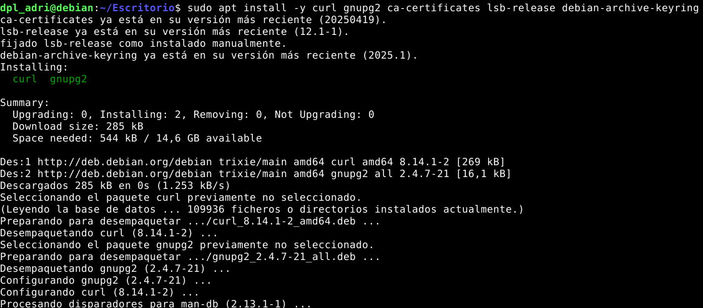

Ahora descargamos, desarmamos y guardamos la clave de firma Nginx:
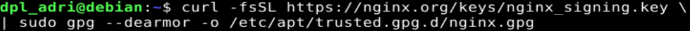

Ahora descargamos, desarmamos y guardamos la clave de firma Nginx:
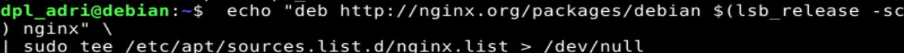

Instalamos el paquete donde esta NGINX
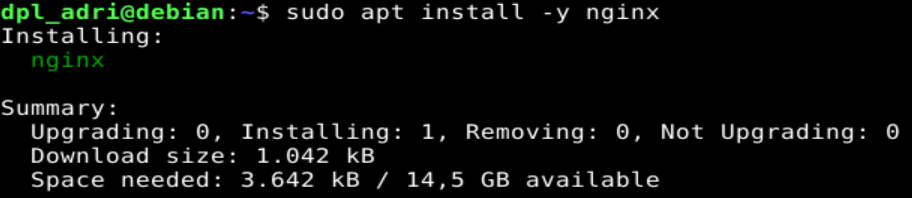

Comprobamos la versión instalada

 (En caso de no tener la misma, debemos actualizar los paquetes con sudo apt update )
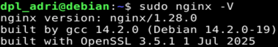

Al comprobar el estado del servicio de NGINX podemos ver que está inactivo


Lo activamos


Volvemos a ver el estatus para ver que efectivamente nos corre
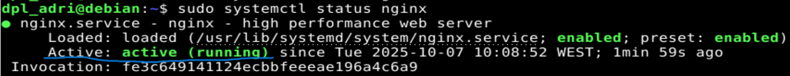

Ya con solo estos pasos, NGINX nos levanta el servicio en localhost una platilla por defecto que nos proporciona NGINX
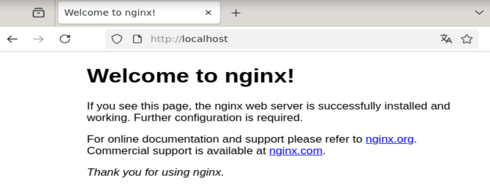

<br><br>

## Instalación Nativa PHP

Instalamos el paquete de PHP


Importamos la clave GPG del repositorio externo desde donde descargarnos la última versión de PHP-FPM:
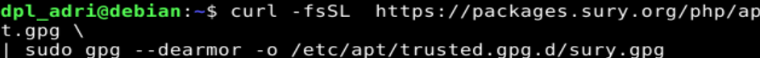

Ahora añadimos el repositorio externo en cuestión:
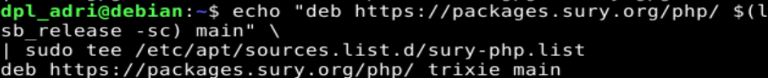

Es posible encontrarnos con varias versiones del paquete. Veamos primero cómo enfocar la búsqueda a los nombres de paquete que nos interesan:
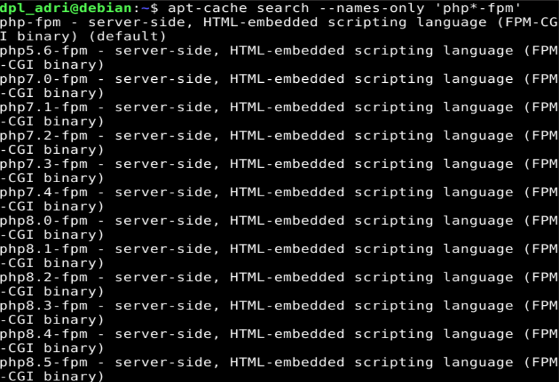

Revisando la salida, nos damos cuenta que la versión más reciente es la v8.4. Instalamos dicha versión:
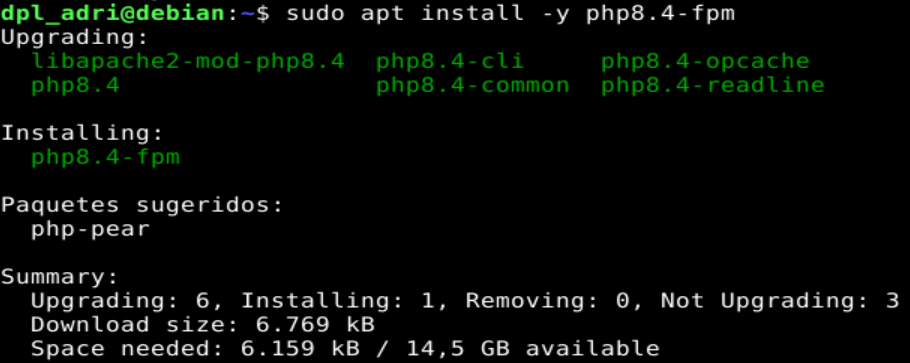

Dado que PHP-FPM se instala en el sistema como un servicio, podemos comprobar su estado utilizando systemd:
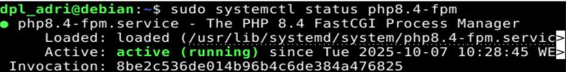

<br>

### Habilitando PHP en NGINX
Nginx es un servidor web que sirve ficheros pero "no sabe" manejar código escrito en PHP (u otros lenguajes). Es por ello que necesitamos un procesador (servidor de aplicación) como PHP-FPM.

Lo primero que hay que hacer es permitir que el usuario nginx tenga acceso al socket unix que abre PHP-FPM. Para ello debemos editar la configuración de PHP-FPM:
```
sudo vi /etc/php/8.4/fpm/pool.d/www.conf
```
Editamos estos parametros dentro de la configuración:
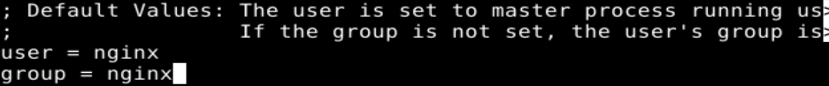
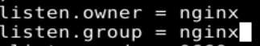

Recargamos el servicio de PHP


Para habilitar la comunicación entre Nginx y PHP-FPM vamos a editar el siguiente fichero de configuración:
```
sudo vi /etc/nginx/conf.d/default.conf
```
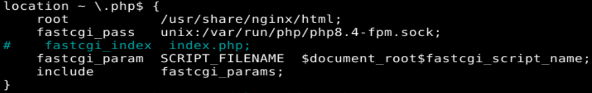

Podemos comprobar que la sintaxis del fichero de configuración es correcta utilizando Nginx:
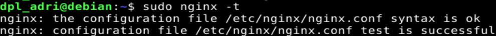

Recargamos el NGINX 
```
sudo systemctl reload nginx
```

### Primera aplicación web en PHP


Creamos un fichero PHP que contendrá un sencillo código mostrando la información de la instalación:
```
echo "<?php phpinfo(); ?>" | sudo tee /usr/share/nginx/html/index.php
```
Abrimos un navegador en la ruta especificada y vemos el resultado:
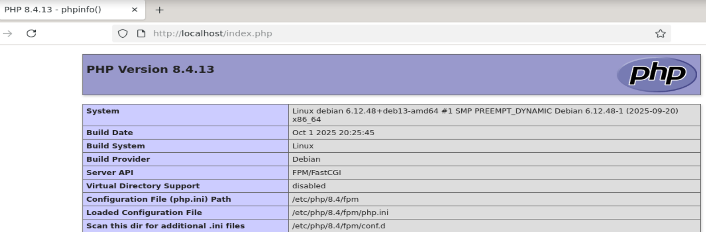

<hr>
**En mi caso hize reload y no funciono entonces recargé los servicio PHP y NGINX y desplegó sin probelmas**

```
sdfgsdf
```

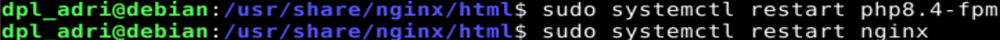
<hr>

Ahora ya que podemos ver que tenemos perfecto los servicios, vamos a reemplazar la plantilla por defecto del PHP por la propia nuestra en:
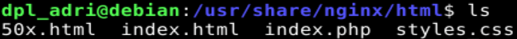


Y Recargamos
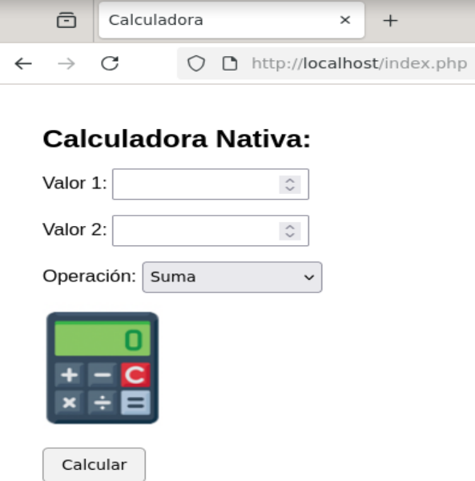


## Instalación Docker NGINX-PHP

Para esta parte nos tenemos que centrar en crear el Dockerfile, donde estará todas las acciones que tiene que hacer el contenedor para configurarse de la forma que le digamos. En nuestro caso es la siguiente:
```
# Imagen base Debian
FROM debian:stable

# Mantenedor
MAINTAINER adrian25 1.0

# Actualizamos e instalamos dependencias
RUN apt update && apt install -y apt-utils curl gnupg2 ca-certificates lsb-release

# Añadimos el repositorio oficial de PHP 8.4
RUN curl -sSL https://packages.sury.org/php/README.txt | grep -q sury \
    && echo "deb https://packages.sury.org/php/ $(lsb_release -sc) main" | tee /etc/apt/sources.list.d/php.list \
    && curl -fsSL https://packages.sury.org/php/apt.gpg | gpg --dearmor -o /etc/apt/trusted.gpg.d/php.gpg

# Instalamos nginx y PHP 8.4 con FPM
RUN apt update && apt install -y nginx php8.4 php8.4-fpm

# Creamos el directorio del usuario y copiamos el archivo PHP
RUN mkdir -p /usr/dpl_adri/calc-docker
COPY index.php /usr/dpl_adri/calc-docker/index.php
RUN chmod 644 /usr/dpl_adri/calc-docker/index.php

# Configuramos Nginx para servir PHP
RUN rm /etc/nginx/sites-enabled/default
RUN echo 'server {\n\
    listen 80;\n\
    root /usr/dpl_adri/calc-docker;\n\
    index index.php index.html;\n\
    server_name localhost;\n\
\n\
    location / {\n\
        try_files $uri $uri/ =404;\n\
    }\n\
\n\
    location ~ \.php$ {\n\
        include snippets/fastcgi-php.conf;\n\
        fastcgi_pass unix:/run/php/php8.4-fpm.sock;\n\
    }\n\
\n\
    location ~ /\.ht {\n\
        deny all;\n\
    }\n\
}' > /etc/nginx/sites-enabled/default

# Exponemos el puerto 80
EXPOSE 80

# Comando para ejecutar PHP-FPM y Nginx juntos
CMD service php8.4-fpm start && nginx -g 'daemon off;'
```
Desplazamos junto al Dockerfile los archivos de la web
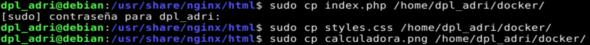

Y empezamos a construir el contenedor con nuestros ajustes del Dockerfile
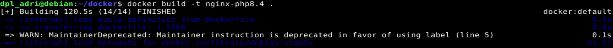

Indicamos que se redirijapor el puerto:
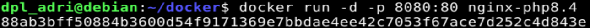

Comprobamos 
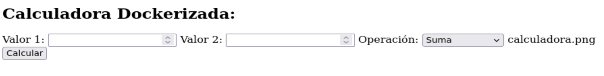

<hr>

#### ***Conclusiones***. <a name="id5"></a>

La práctica ha permitido desplegar una aplicación PHP que funciona como calculadora tanto en un entorno nativo como en un entorno dockerizado.

Se ha aprendido a configurar Nginx con PHP-FPM y a crear un contenedor Docker que sirva la aplicación, comprobando que funciona correctamente en ambos casos.

Además, se ha podido comprobar la ventaja de Docker para aislar el entorno, facilitar la portabilidad y simplificar el despliegue de aplicaciones web.
