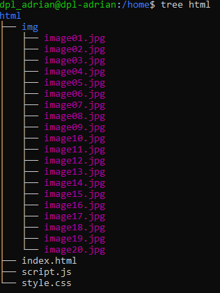
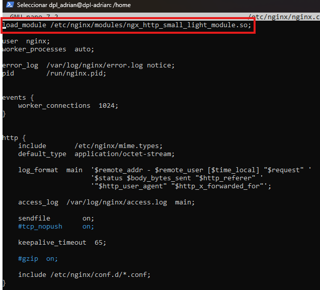
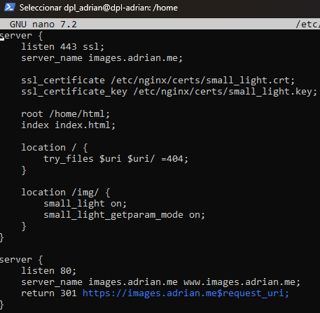
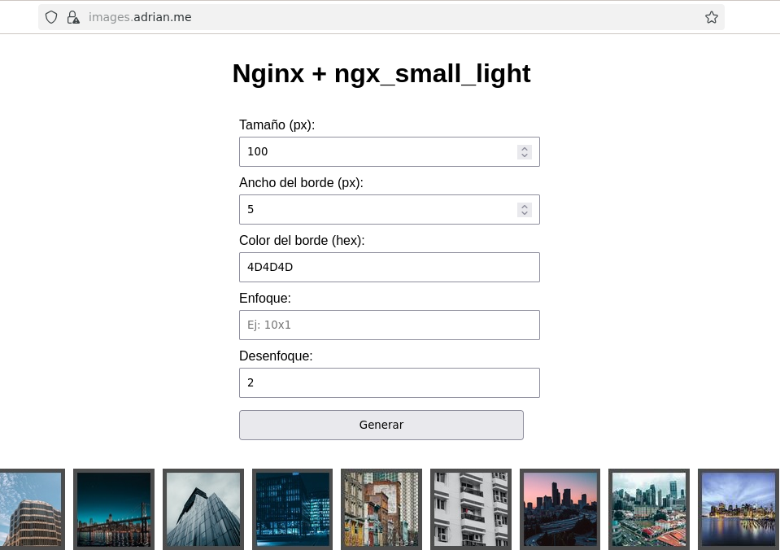

<center>

# UT3-A1 Administración de servidores web


</center>

***Nombre:*** Adrián Hernández Dévora
***Curso:*** 2º de Ciclo Superior de Desarrollo de Aplicaciones Web.

### ÍNDICE

+ [Introducción](#id1)
+ [Objetivos](#id2)
+ [Material empleado](#id3)
+ [Desarrollo](#id4)
+ [Conclusiones](#id5)


#### ***Introducción***. <a name="id1"></a>

La práctica aborda el despliegue de un servicio web basado en Nginx, configurado para integrar el módulo externo ngx_small_light, destinado al procesamiento dinámico de imágenes. Este módulo permite aplicar transformaciones en tiempo real —como redimensionado, modificación del borde, enfoque o desenfoque— a partir de parámetros transmitidos mediante peticiones HTTP GET, evitando la generación previa de variantes de cada imagen.


Dado que ngx_small_light no está incluido en la distribución estándar de Nginx, su utilización requiere la compilación del módulo como extensión dinámica, proceso que implica obtener y compilar el código fuente del servidor con soporte para dicho módulo.

#### ***Objetivos***. <a name="id2"></a>

- Instalar el módulo ngx_small_light y cargarlo dinámicamente en Nginx.
- Crear un virtual host específico que atienda peticiones en el dominio images.nombrealumno.me - (server_name).
- Habilitar el módulo ngx_small_light en el virtual host sólo para el location /img.
- Subir las imágenes de images.zip (el archivo de adjunta a la tarea ) a una carpeta img dentro de la - carpeta de trabajo elegida.
- Crear una aplicación web que permita el tratamiento de dichas imágenes.
- Incorporar certificado de seguridad (mostrar el certificado 🔒).
- Redirigir el subdominio www al dominio base (incluyendo ssl).

#### ***Material empleado***. <a name="id3"></a>

- Sistema operativo anfitrión: Debian12 
- Servidor web: Nginx 1.28.0
- Módulo de procesamiento de imágenes: ngx_small_light, obtenido desde el repositorio oficial de GitHub
- Herramientas de compilación y bibliotecas necesarias: build-essential, imagemagick, libpcre3, libpcre3-dev, libmagickwand-dev
- Subdominio: img.adrian.me
- Certificado SSL
- Docker para la creación, ejecución y exportación del contenedor de Nginx

#### ***Desarrollo***. <a name="id4"></a>

## Actualizamos e Instalamos Nginx:
```
sudo apt update && sudo apt upgrade -y
sudo apt install -y nginx
```

## Creamos el directorio donde vamos alojar el HTML, CSS y JS del proyecto:


## Instalamos las dependencias de ngx_small_light
```
sudo apt install -y build-essential git wget \
    imagemagick libpcre3 libpcre3-dev libjpeg-dev libpng-dev \
    pkg-config libmagickwand-dev
```

## Descargar y montar su setup
```
cd /tmp
git clone https://github.com/cubicdaiya/ngx_small_light.git
cd ngx_small_light
./setup
```

## Compilamos el módula Dinámicamente
Para ello, vamos a descargarnos el source
```
cd /tmp
wget http://nginx.org/download/nginx-1.28.0.tar.gz
tar xzf nginx-1.28.0.tar.gz
cd nginx-1.28.0
```

Con ./Cofigure, lo que va realizar añadir el módulo y el make compila el módulo
```
./configure --with-compat --add-dynamic-module=/tmp/ngx_small_light
make modules
```

Y movemos el .so al siguiente directorio:
```
sudo mkdir -p /etc/nginx/modules
sudo cp objs/ngx_http_small_light_module.so /etc/nginx/modules/
```

## Activación del Módulo
Vamos a editar el nginx.conf y cargar el modulo de la siguiente manera:

Ejecutamos
```bash
sudo nano /etc/nginx/nginx.conf
```

Añadimos 



## Configurar virtual Host Nativo

Nos dirigimos al directorio /etc/nginx/conf.d/ y editamos a1_small_light.conf así:



## Certificados

Para el proyecto vamos a generar unos autocertificados autofirmados. Nos crearemos una carpeta donde guardaremos esos certificados
```
sudo mkdir -p /etc/nginx/certs
sudo openssl req -x509 -nodes -days 365 \
  -newkey rsa:2048 \
  -keyout /etc/nginx/certs/small_light.key \
  -out /etc/nginx/certs/small_light.crt
```

## Recargamos el Nginx
```
sudo nginx -t
sudo systemctl reload nginx
```

Y nos devería ver la web con la resolución de nombre

(En caso de no ver url del navegador abrir imagen)


#### ***Conclusiones***. <a name="id5"></a>


La práctica ha permitido comprender en profundidad el proceso de despliegue y personalización de un servidor Nginx mediante la integración de módulos externos. La compilación y carga dinámica de ngx_small_light ha demostrado la flexibilidad del servidor para extender sus capacidades, en este caso aplicando transformaciones de imágenes en tiempo real. Además, la configuración del virtual host, la gestión de certificados SSL y la correcta estructuración del entorno han reforzado el manejo de servicios web seguros y funcionales. En conjunto, la actividad ha proporcionado una visión práctica y completa sobre la administración avanzada de servidores web en entornos Linux.
