<center>

# UT4-A2 Administración de servidores de aplicaciones ( PostgreSQL )


</center>

***Nombre:*** Adrián Hernández Dévora

***Curso:*** 2º de Ciclo Superior de Desarrollo de Aplicaciones Web.

### ÍNDICE

+ [Introducción](#id1)
+ [Objetivos](#id2)
+ [Material empleado](#id3)
+ [Desarrollo](#id4)
+ [Conclusiones](#id5)


#### ***Introducción***. <a name="id1"></a>

En esta práctica se aborda la preparación de la infraestructura de la capa de datos y la puesta en marcha de una aplicación PHP
para la gestión de los datos de TravelRoad. Se pretende que los estudiantes adquieran experiencia práctica en la instalación y 
configuración de bases de datos PostgreSQL, herramientas de administración como pgAdmin, así como en el desarrollo, despliegue y 
mantenimiento de una aplicación PHP tanto en entornos de desarrollo como de producción. La actividad incluye también la 
implementación de buenas prácticas en control de versiones y despliegue automático mediante scripts.

#### ***Objetivos***. <a name="id2"></a>

1. Preparar la capa de datos: Instalar y configurar PostgreSQL en entornos de desarrollo y producción, y cargar los datos de prueba de la aplicación TravelRoad.

2. Administración de la base de datos: Instalar y configurar pgAdmin en ambos entornos, incluyendo dominios específicos y certificados de seguridad en producción.

3. Desarrollo de la aplicación: Crear una aplicación PHP que acceda a la base de datos local, mostrando los datos de TravelRoad, utilizando buenas prácticas de programación y control de versiones.

4. Despliegue en producción: Clonar el repositorio en la máquina de producción, configurar el acceso a la base de datos, virtual hosts, certificados de seguridad y redirecciones de dominio.

5. Automatización del despliegue: Crear un script deploy.sh que facilite la actualización automática de la aplicación en producción mediante SSH y git pull.

#### ***Material empleado***. <a name="id3"></a>

Software y herramientas:
- PostgreSQL (instalado en máquina local y remota)
- pgAdmin (con dominios diferenciados para desarrollo y producción)
- PHP 8.2 con extensión php-pgsql
- Servidor web (Nginx o Apache)
- Git para control de versiones


Recursos:

- Datos de prueba de TravelRoad
- Certificados de seguridad para producción
- Scripts de configuración (config.php) excluidos del control de versiones
- Script de despliegue deploy.sh
- Entornos:
- Máquina de desarrollo local
- Máquina de producción remota

#### ***Desarrollo***. <a name="id4"></a>

# PostgreSQL

Para empezar, vamos a instalar algunos paquetes de soporte:

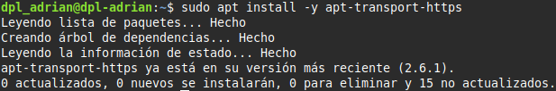

A continuación descargamos la clave de firma para el repositorio oficial de PostgreSQL:

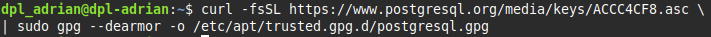

Añadimos el repositorio oficial de PostgreSQL al sistema:

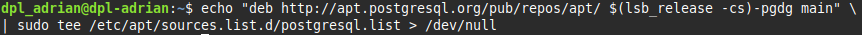


Ahora volvemos a actualizar la paquetería (sudo apt update)

Instalamos la última versión:

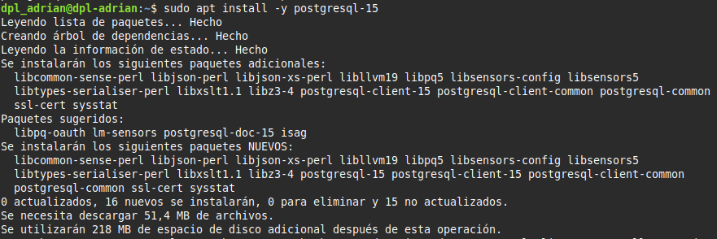

Revisamos que la versión instalada sea la correcta:

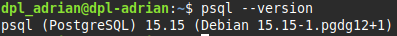

Tras la instalación, el servicio PostgreSQL se arrancará automáticamente. Podemos comprobarlo de la siguiente manera y observando el enabled:

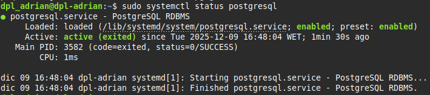


El puerto por defecto en el que trabaja PostgreSQL es el 5432:

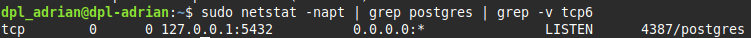
(En caso de que no puedas puede ser por no tener instalado el paquete net-tools)

Ahora vamos a iniciar sesión en el sistema gestor de bases de datos:

```
sudo -u postgres psql
```

## Base de datos

Vamos a crear una base de datos y un rol de acceso a la misma:

```
postgres=# CREATE USER travelroad_user WITH PASSWORD 'dpl0000';
CREATE ROLE

postgres=# CREATE DATABASE travelroad WITH OWNER travelroad_user;
CREATE DATABASE
```

A continuación accedemos al intérprete PostgreSQL con el nuevo usuario:

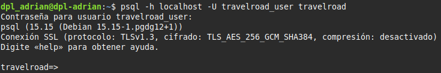

Ahora ya podemos crear la tabla de lugares:

```
travelroad=> CREATE TABLE places(
id SERIAL PRIMARY KEY,
name VARCHAR(255),
visited BOOLEAN);
CREATE TABLE
```
(En este momento no hay datos en la tabla)

## Carga de datos

Vamos a cargar los datos desde este fichero places.csv a la tabla places descargando este fichero:

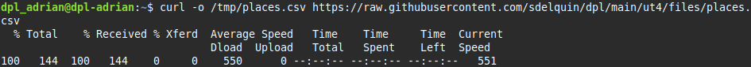

A continuación usaremos la función copy de PostgreSQL para insertar los datos en la tabla:

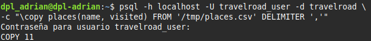

Comprobamos que los datos se han insertado de manera adecuada iniciando de nuevo al la BD y hacer esta consulta:
```
travelroad=> SELECT * FROM places;
 id |    name    | visited
----+------------+---------
  1 | Tokio      | f
  2 | Budapest   | t
  3 | Nairobi    | f
  4 | Berlín     | t
  5 | Lisboa     | t
  6 | Denver     | f
  7 | Moscú      | f
  8 | Oslo       | f
  9 | Río        | t
 10 | Cincinnati | f
 11 | Helsinki   | f
(11 filas)
```

# pgAdmin

pgAdmin es un software escrito en python. Lo primero de todo será instalar Python. 

Aunque existen paquetes precompilados en la paquetería de los distintos sistemas operativos, vamos a descargar la última versión desde la página oficial y compilar los fuentes para nuestro sistema.

Dado que Python instala ciertas herramientas ejecutables en línea de comandos, es necesario aseguramos que la ruta a estos binarios está en el PATH:

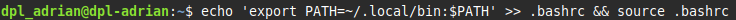

e instalamos python3.11-venv:

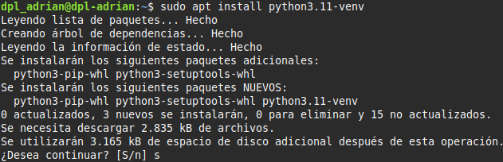

## Instalación

Creamos las carpetas de trabajo con los permisos adecuados:

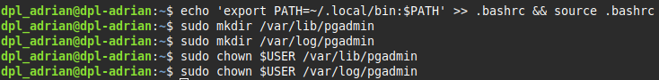

Creamos un entorno virtual de Python desde el $HOME:


lo activamos

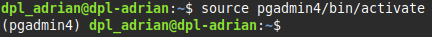

e instalamos el paquete de pgadmin4 en él:

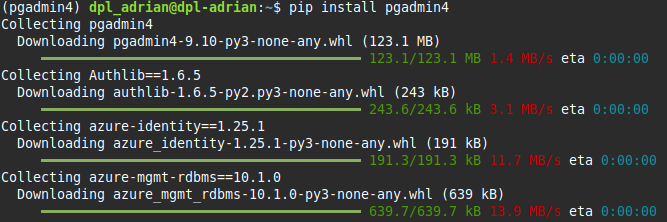

Ahora lanzamos el script de configuración en el que tendremos que dar credenciales para una cuenta "master":

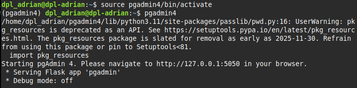
(Aunque este script lanza un servidor de desarrollo en el puerto 5050 no nos interesa de momento ya que queremos desplegar con garantías. Pusamos CTRL-C para detener el proceso)

## Procesador de peticiones WSGI

Podemos instalarlo como un paquete Python adicional (dentro del entorno virtual):

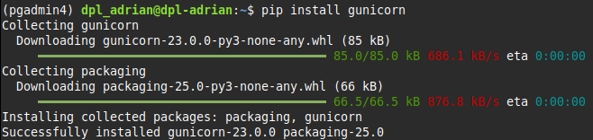

Ahora ya estamos en disposición de levantar el servidor pgAdmin utilizando gunicorn:

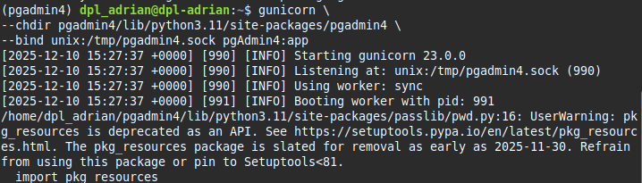


## Virtualhost en Nginx

Tenemos que levantar el virtual host en Nginx para nuestra aplicación web:

```
sudo vi /etc/nginx/conf.d/pgadmin.conf
```
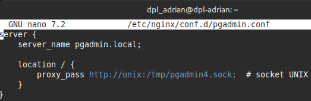

y si recargamos nginx (systemctl restart nginx)

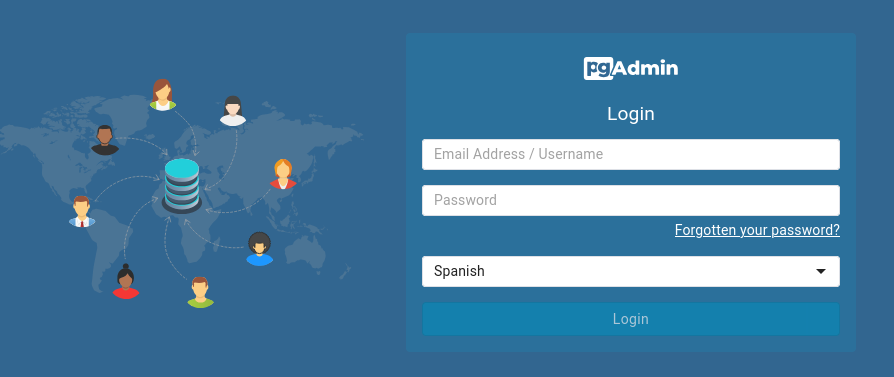

## Demonizando el servicio

Para ahorrarnos el tener que mantener el proceso gunicorn funcionando en una terminal, vamos a demanizarlo.

```
sudo nano /etc/systemd/system/pgadmin.service
```

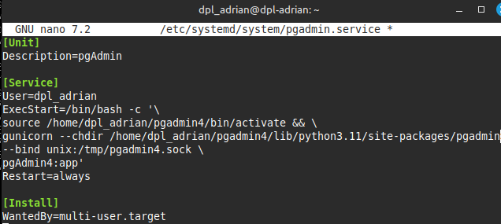


A continuación recargamos los servicios para luego levantar pgAdmin y habilitarlo en caso de reinicio del sistema:

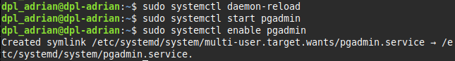

Por último comprobamos que el servicio está funcionando correctamente:

```
sudo systemctl is-active pgadmin
 active
```

## Registrando un servidor
 
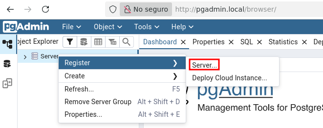

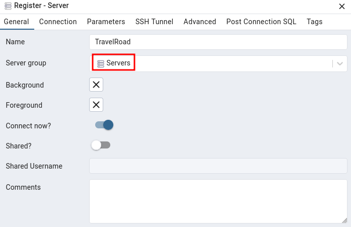

Y luego desde la pestaña Connection finalizando con el botón Save:

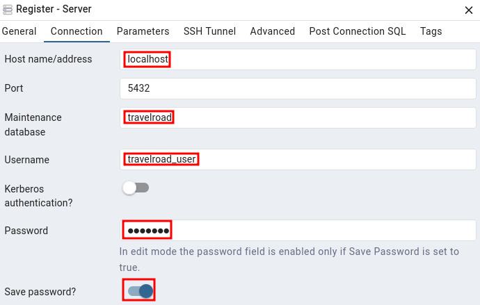

## Acceso externo

Vamos a modificar /etc/postgresql/15/main/postgresql.conf para que PostgreSQL no solo permita conexiones desde localhost

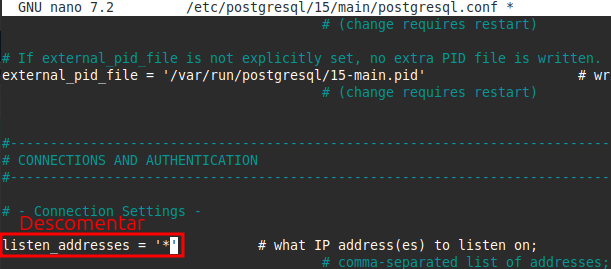


permitir el acceso del usuario travelroad_user a la base de datos travelroad desde cualquier IP de origen:

```
sudo nano /etc/postgresql/15/main/pg_hba.conf
```

añadir al final de /etc/postgresql/15/main/pg_hba.conf

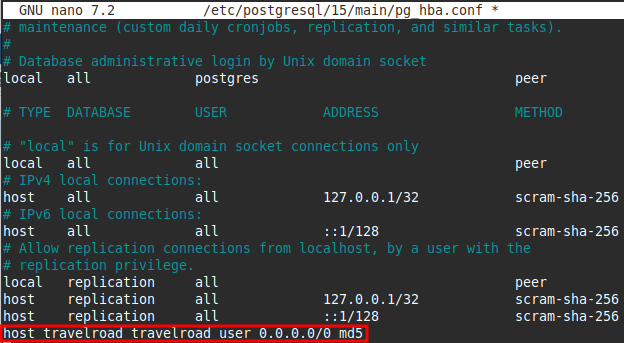

recargamos el postgresql

```
sudo systemctl restart postgresql
```

Podemos comprobar que el servicio PostgreSQL ya está escuchando en todas las IPs:

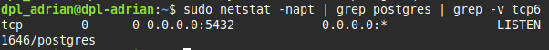

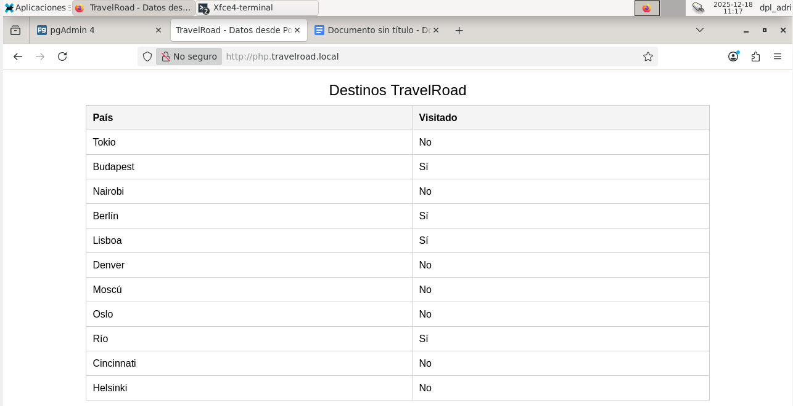

## Nginx
Desarrollo:

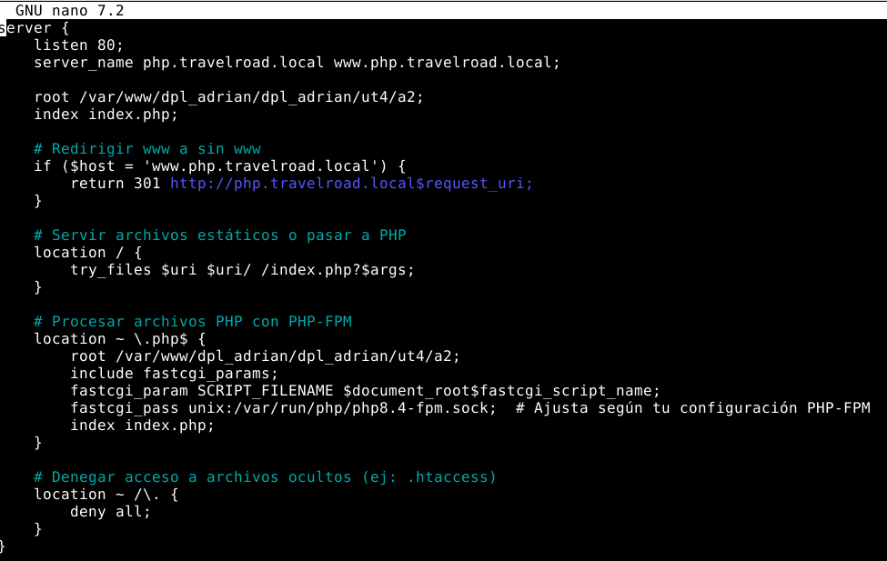

Producción:

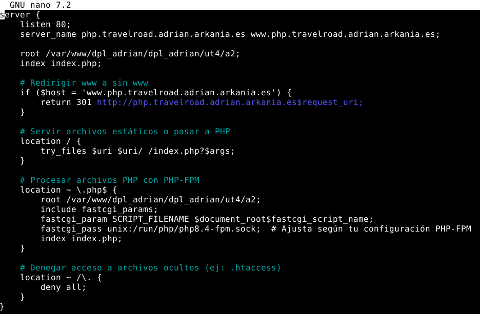

Para la parte de producción, debemos de seguir los mismos pasos que en producción.


# Git y Script

Podemos tener archivos del proyecto con un control de versiones para pasar cambios de una máquina a otra en caso de hacer cambios en la aplicación web y aplicar los cambios tras comprobar que funcionan en desarrollo.

Este lo podemos complementar con un script para que desde la máquina de desarrollo, poder aplicar los cambios de una forma más automatizada. 

Para ello podríamos hacer uno como este:

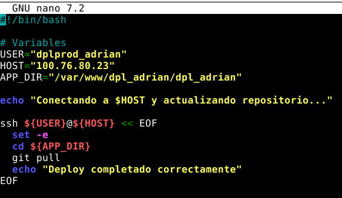

En el que accedemos a la máquina y poder hacer un pull del repocitorio.

#### ***Conclusiones***. <a name="id5"></a>

La realización de esta práctica permite al estudiante integrar y gestionar los distintos componentes de una aplicación web completa: base de datos, interfaz de administración y aplicación PHP. Se refuerza la comprensión de la separación entre entornos de desarrollo y producción, el uso de control de versiones y la importancia de la automatización en el despliegue de aplicaciones. Además, se adquiere experiencia en la configuración de seguridad mediante certificados SSL y la gestión de accesos a la base de datos, consolidando habilidades fundamentales para el desarrollo y mantenimiento de aplicaciones web modernas.